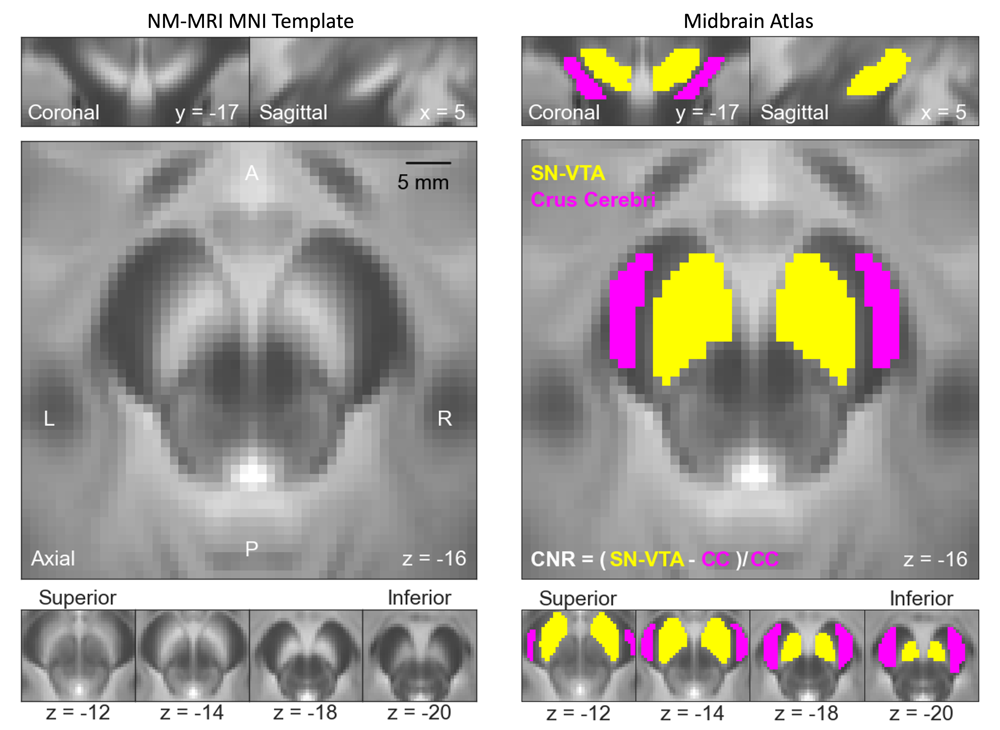

# **KCL_Neuromelanin-MRI**  
### **King's College London (KCL) Neuromelanin-Sensitive MRI (NM-MRI) Analysis Pipeline & Midbrain Atlas**  

  

---

## **Overview**  

This repository provides code for generating **SN-VTA NM-MRI contrast-to-noise ratios (NM-CNRs)** from NM-MRI data, site-specific **NM-MRI templates** (in MNI space), and a **midbrain atlas** that includes:  
- **Substantia Nigra & Ventral Tegmental Area (SN-VTA)** – the primary region of interest  
- **Crus Cerebri (CC)** – a control region  

The **healthy control NM-MRI template** was generated from **80 participants**, while the **patient NM-MRI template** was derived from **74 individuals diagnosed with schizophrenia**.  

Additionally, this repository includes **quantitative susceptibility mapping (QSM) templates**—an iron-sensitive MRI technique—generated from **80 healthy controls** and **79 patients with schizophrenia**.  

This dataset and code were developed to examine case-control differences in **SN-VTA NM-CNR** and its correlation with **striatal dopamine synthesis capacity**.  

📚 Full study details, methods, and findings are available in [Biological Psychiatry](https://www.biologicalpsychiatryjournal.com/article/S0006-3223(24)01417-3/fulltext).  

📌 If you use the data or code from this repository, **please cite the publication**:  
Vano LJ, McCutcheon RA, Rutigliano G, et al.: Mesostriatal Dopaminergic Circuit Dysfunction in Schizophrenia: A Multimodal Neuromelanin-Sensitive Magnetic Resonance Imaging and [18F]-DOPA Positron Emission Tomography Study. Biological Psychiatry 2024; 96:674–683

This analysis pipeline was developed based on methodologies from the [Horga Lab](https://www.columbiapsychiatry.org/research-labs/horga-lab), as outlined in:  
Cassidy CM, Zucca FA, Girgis RR, et al.: Neuromelanin-sensitive MRI as a noninvasive proxy measure of dopamine function in the human brain. Proc Natl Acad Sci U S A 2019; 116:5108–5117

📧 For any inquiries, please contact:  
Dr. Luke Vano: drlukevano@gmail.com  
Prof. Oliver Howes: oliver.howes@kcl.ac.uk

---

## **File Structure**  

This repository follows a **BIDS-like format** and includes **unprocessed** and **processed** data from two volunteers.

```
📦 KCL_NM-MRI/
 ├📂 logs/                 # Log files from the data analysis  
 ├📂 nifti/                # Unprocessed subject T1w and NM-MRI data  
 ├📂 output/               # Processed subject data  
 ├📂 results/              # Subject SN-VTA NM-CNR results  
 ├📂 scripts/              # Code files & analysis scripts  
 ├📂 templates/            # Midbrain atlas (SN-VTA & CC masks), NM-MRI & QSM templates in MNI space  
 ├📄 README.md             # Overview of the project  
 ├📄 LICENSE               # MIT open-source license  
 ├📄 requirements.txt      # Python dependencies  
 └📄 environment.yml       # Conda environment (alternative to requirements.txt)  
```

---

## **Usage**  
This section provides instructions for setting up the pipeline and running the analysis. The analysis can be run serially or in parallel using SLURM. Also provided are commands for running the analysis on the King's College London Neuroimaging analysis Network (NaN) tcsh shell.

### **1. Create and Activate a Virtual Environment with Dependencies**  

#### **Using Conda:**
```
module load miniconda
conda env create --name kcl_nm --file environment.yml  # Create environment
conda activate kcl_nm  # Activate environment
```

#### **Using PIP:**
```
module load miniconda
conda create -n kcl_nm python=3.11.11
conda activate kcl_nm
pip install -r requirements.txt
```

### **2. Load Required Shell Dependencies**  
Ensure the following dependencies are installed before running the pipeline:  
- **FSL** (v6.0.5.2)  
- **FreeSurfer** (v7.3.2)  

For NaN Users:
```
module load fsl/6.0.5.2
module load freesurfer
```

### **3. Upload the Subject Data**  
The code is designed to work with subject data with the following structure:
```
{Github_root_path}/nifti/{subject}/anat/{subject}_T1w.nii.gz
{Github_root_path}/nifti/{subject}/anat/{subject}_NM.nii.gz
```
For example:
```
./KCL_NM-MRI/nifti/sub-001/anat/sub-001_T1w.nii.gz
./KCL_NM-MRI/nifti/sub-001/anat/sub-001_NM.nii.gz
```

If modifying this structure, update lines 24-39 in `main_script.py`.

Update `scripts/subjects.txt` so that each line has a different subject ID (e.g., `sub-001`, `sub-002`).

### **4. Running the Pipeline**  

#### **Serial Subject Analysis**
The analysis can be run serially by running `scripts/main_script.py` in Python. The following inputs are required:

Run `scripts/main_script.py` using the following inputs:
```
python {Github_root_path}/scripts/main_script.py    --nifti_dir {Github_root_path}/nifti \
                                                    --output_dir {Github_root_path}/output \
                                                    --templates_dir {Github_root_path}/templates \
                                                    --results_dir {Github_root_path}/results \
                                                    --subject_list {Github_root_path}/scripts/subjects.txt \
                                                    --apply_robustfov True \
                                                    --num_threads 4 \
                                                    --interpolator genericLabel
```

##### **Argument Descriptions:**
- `--nifti_dir`: Path to the input data directory  
- `--output_dir`: Path to the output data directory  
- `--templates_dir`: Path to the templates directory  
- `--results_dir`: Path to the subject SN-VTA results  
- `--subject_list`: Path to the subject list  
- `--apply_robustfov`: Crop the lower head and neck from the T1w images (default = False)  
- `--num_threads`: Number of CPU threads per subject  
- `--interpolator`: Advanced Normalization Tools (ANTs) interpolation method for the midbrain atlas (default = genericLabel)  

#### **Parallel Subject Analysis**
Processing takes ~3 hours per subject. Parallel analysis is recommended.

To use `script/SLURM_parallel.job`:
1. Update `#SBATCH` parameters.
2. Ensure dependencies are loaded in the **SHELL Configuration** section.
3. Run the SLURM job:
```
sbatch {Github_root_path}/script/SLURM_parallel.job
```

---

### **6. Results**  
Processed Output Files:
- Processed T1w and NM-MRI Images (cropped & bias-corrected)  
- NM-MRI Contrast-to-Noise Ratio (NM-CNR) Images  
- Transformations Between T1w, NM-MRI, and MNI Spaces  
- Midbrain Atlas Masks (SN-VTA & CC in NM-MRI Space)  
- Mean & Standard Deviation of NM-CNR in SN-VTA (Excel file in `results/`)  

---

## **License**  
This repository is licensed under the Creative Commons Attribution-NonCommercial 4.0 International License (CC BY-NC 4.0). See [LICENSE](LICENSE.md) for details.  

## **Citation**  
If you use this repository, please cite:  
📚 Vano LJ, McCutcheon RA, Rutigliano G, et al.: Mesostriatal Dopaminergic Circuit Dysfunction in Schizophrenia: A Multimodal Neuromelanin-Sensitive Magnetic Resonance Imaging and [18F]-DOPA Positron Emission Tomography Study. Biological Psychiatry 2024; 96:674–683
[Biological Psychiatry](https://www.biologicalpsychiatryjournal.com/article/S0006-3223(24)01417-3/fulltext)  

